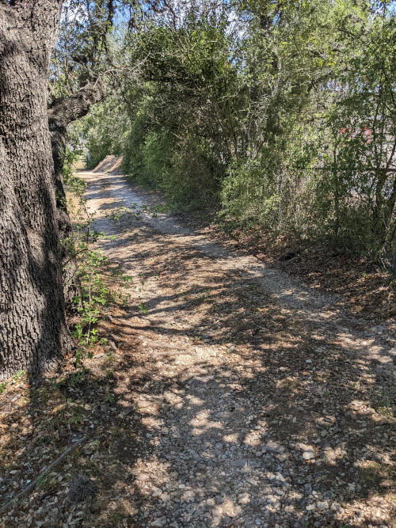

I live near the Oak Hill Cemetery in Austin, and for a while I have been meaning
to visit it. This weekend, I finally had the opportunity to check it out.

<!--more-->

The cemetery is rather interesting. The earliest person born was in the early
19th century. The last person buried in the cemetery seemed to be in 2019. Some
of the headstones had eroded so much that they were no longer readable.

There were quite a few veterans in there including 1 from the Confederate side
of the Civil War, some from World War 1, more from World War 2, and at least 1
from the Korean War. There were a few who were veterans of multiple wars too.

I saw some headstones for unnamed children including 1 who was born and died on
the same day. I thought these unnamed headstones were pretty moving. Felt like I
could feel the emotional pain of the parents.

There were some plots in the cemetery for whole families. One included a
daughter situated in between her parents. I quite liked the symbolism of that
one. I also saw many husband and wife duos. They lived their lives together, and
wanted to spend eternity next to each other. Extremely poetic in my opinion.

Cemeteries like this are almost frozen in time for the most part. Most of the
people buried there probably had already had their last visitor. Really makes
you appreciate the following excerpt from Irvin Yalom's _Love's Executioner and
Other Tales of Psychotherapy_:

> Some day soon, perhaps in forty years, there will be no one alive who has ever
> known me. That's when I will be truly dead - when I exist in no one's memory.
> I thought a lot about how someone very old is the last living individual to
> have known some person or cluster of people. When that person dies, the whole
> cluster dies, too, vanishes from the living memory. I wonder who that person
> will be for me. Whose death will make me truly dead?

I usually quote the [Banksy](https://en.wikipedia.org/wiki/Banksy) version of
this idea however:

> I mean, they say you die twice. One time when you stop breathing and a second
> time, a bit later on, when somebody says your name for the last time.

I probably spent about 30 minutes walking through the pretty small cemetery. As
I got to the back, I noticed a lot of trash along the fence line. I thought it
was very disrespectful to the dead that called the cemetery home. I remembered
that there used to be a homeless camp out in this part of Oak Hill. I figured
that this trash was probably a remnant of that. The trash was largely single-use
plastics, pill casings, and beer cans. Figured the person that lived here was
probably an alcoholic from all that I saw.

I ended up going home after my walkthrough, but for whatever reason it didn't
sit well with me that all this trash was there, and no one was going to remove
it, probably. The next day, a Sunday, I decided I would do some good for the
world. I got my "trash grabber", some garbage bags, and some recycle bags. I
think I spent about an hour and a half at the cemetery picking up trash. Luckily
I brought my wireless speaker with me, so I could jam while doing it. At the end
of my time at the cemetery, I came away with 1 30-gallon bag of recyclables
filled, and 1 13-gallon bag of trash. I was able to get all the trash along the
inner fence line of the cemetery. However, I am just one man. I wasn't able to
get it all. There is a lot more trash on the other side of the fence. I think
I'll go back to collect more garbage in the future when I find a dull moment.

Overall, the cemetery was a good experience. I got to learn a bit of history of
my area, and I was able to say many of these people's names again, so on the
chance souls are real, the deceased know that they aren't completely dead yet.
